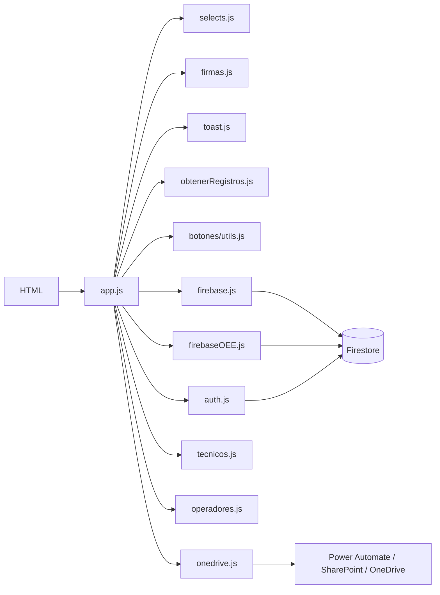
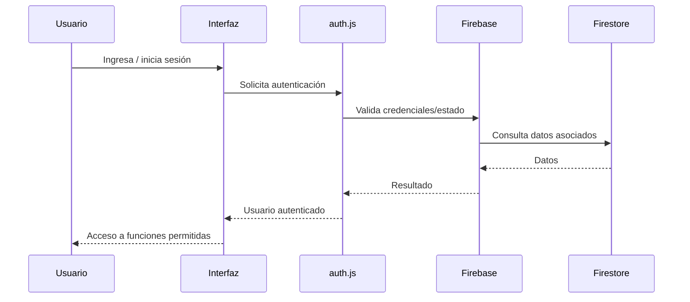
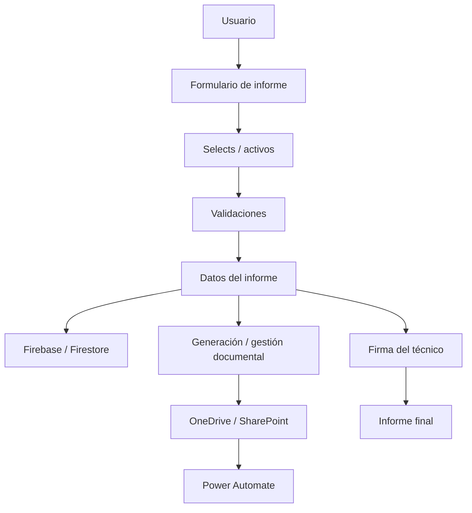
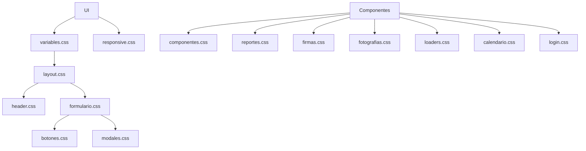
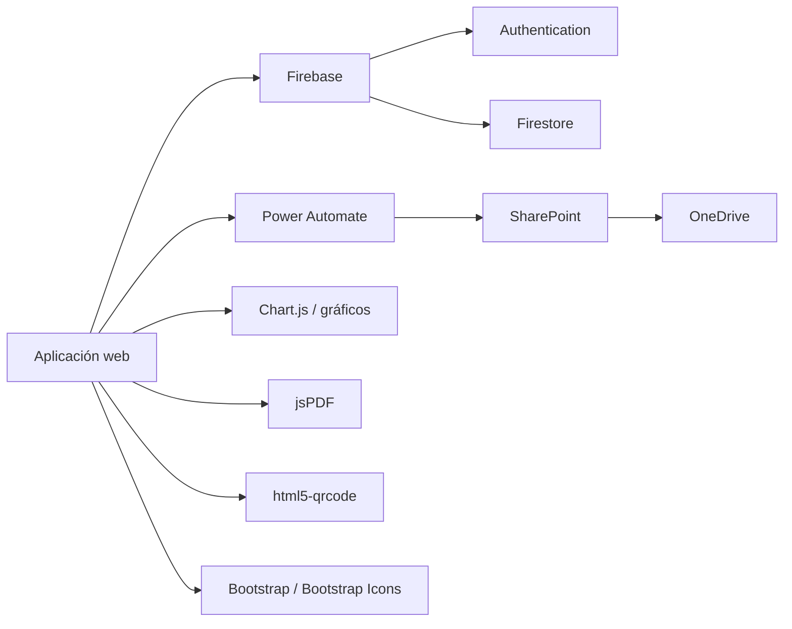

# Arquitectura del proyecto ORG — Sistema de Mantenimiento

> Documento de arquitectura y mapa de relaciones entre páginas, JavaScript, CSS, servicios, integraciones y funciones principales.

## 1. Visión general

```mermaid
flowchart TD
    ORG["ORG — Sistema de Mantenimiento"]
    UI["Páginas / UI"]
    JS["Núcleo JavaScript"]
    AUTH["Firebase / Auth"]
    EXT["Integraciones externas"]
    CSS["CSS"]

    ORG --> UI
    ORG --> JS
    ORG --> AUTH
    ORG --> EXT
    ORG --> CSS

    UI --> INDEX[index.html]
    UI --> OP[crear-operadores.html]
    UI --> PAGES[pages/*.html]

    JS --> APP[src/js/app.js]
    JS --> SELECTS[src/js/selects.js]
    JS --> FIRMAS[src/js/firmas.js]
    JS --> TOAST[src/js/toast.js]
    JS --> UTILS[src/js/botones/utils.js]
    JS --> REG[src/js/obtenerRegistros.js]

    AUTH --> FIRE[src/js/services/firebase/firebase.js]
    AUTH --> OEE[src/js/services/firebase/firebaseOEE.js]
    AUTH --> AUTHJS[src/js/services/firebase/auth.js]
    AUTH --> OPER[src/js/services/firebase/operadores.js]
    AUTH --> TEC[src/js/services/firebase/tecnicos.js]

    EXT --> OD[src/js/services/onedrive/onedrive.js]
    EXT --> LOADER[src/js/services/onedrive/loader.js]
    EXT --> PA[Power Automate / SharePoint / OneDrive]

    CSS --> VAR[variables.css]
    CSS --> LAYOUT[layout.css]
    CSS --> HEADER[header.css]
    CSS --> FORM[formulario.css]
    CSS --> MOD[modales.css]
    CSS --> RESP[responsive.css]
    CSS --> REPORT[reportes.css]
```



## 2. Estructura principal

```text
ORG/
├── index.html
├── crear-operadores.html
├── iniciar-servidor.bat
├── pages/
│   ├── causales-mobile.html
│   ├── checklist.html
│   ├── cronograma.html
│   ├── imprimir.html
│   ├── levas.html
│   ├── lista_cheque.html
│   └── qr_generar.html
├── src/
│   ├── css/
│   │   ├── variables.css
│   │   ├── layout.css
│   │   ├── header.css
│   │   ├── formulario.css
│   │   ├── botones.css
│   │   ├── modales.css
│   │   ├── firmas.css
│   │   ├── fotografias.css
│   │   ├── loaders.css
│   │   ├── reportes.css
│   │   ├── componentes.css
│   │   ├── responsive.css
│   │   ├── calendario.css
│   │   └── login.css
│   └── js/
│       ├── app.js
│       ├── selects.js
│       ├── firmas.js
│       ├── toast.js
│       ├── obtenerRegistros.js
│       ├── botones/utils.js
│       └── services/
│           ├── firebase/
│           │   ├── firebase.js
│           │   ├── firebaseOEE.js
│           │   ├── auth.js
│           │   ├── operadores.js
│           │   └── tecnicos.js
│           └── onedrive/
│               ├── onedrive.js
│               └── loader.js
└── src/assets/
    ├── images/
    └── firmas/
```

## 3. Relaciones JavaScript



## 4. Archivo → funciones y símbolos principales

| Archivo | Responsabilidad | Funciones / símbolos identificados |
|---|---|---|
| `app.js` | Orquestación de la aplicación | Inicialización, eventos y flujo principal de informes |
| `selects.js` | Selects y datos dependientes | `obtenerActivos()`, `coincideActivo()` |
| `firmas.js` | Gestión de firmas | `initFirmas()`, `cargarTecnicoActual()`, `obtenerNombreTecnico()`, `firmasPersonas` |
| `toast.js` | Notificaciones UI | `mostrarToast()` |
| `botones/utils.js` | Utilidades comunes | `sanitize()`, `FirebaseError`, `SharePointError` |
| `obtenerRegistros.js` | Consulta de registros | Recuperación/procesamiento de registros |
| `auth.js` | Autenticación | Estado de `auth.currentUser` |
| `firebase.js` | Configuración Firebase | Inicialización y acceso a Firebase |
| `firebaseOEE.js` | Firebase para OEE | Acceso a datos OEE |
| `operadores.js` | Operadores | `validarOperadorDesdeFormulario()`, `validarOperador()` |
| `tecnicos.js` | Técnicos | `obtenerNombreTecnico()` y lógica relacionada |
| `onedrive.js` | Integración documental | Comunicación con Power Automate / SharePoint / OneDrive |
| `loader.js` | Carga de integración | Inicialización/carga de servicios externos |

## 5. Flujo de autenticación



## 6. Flujo de firmas

```mermaid
flowchart TD
    USER[Usuario autenticado] --> TEC[Identificación del técnico]
    TEC --> NOMBRE[obtenerNombreTecnico()]
    NOMBRE --> MAP[firmasPersonas]
    MAP --> INIT[initFirmas()]
    INIT --> IMG[Imagen de firma]
    IMG --> UI[Informe técnico]
```

## 7. Flujo del informe técnico



## 8. Utilidades y validación

```mermaid
flowchart LR
    INPUT[Entrada del usuario] --> SAN[sanitize()]
    SAN --> VALID[Validación]
    VALID --> OK[Procesamiento]
    VALID --> ERR[Error controlado]
    ERR --> FB[FirebaseError]
    ERR --> SP[SharePointError]
    OK --> TOAST[mostrarToast()]
    ERR --> TOAST
```

## 9. CSS y presentación



## 10. Integraciones externas



## 11. Puntos de atención arquitectónica

### Seguridad

- `src/js/services/onedrive/onedrive.js` contiene una URL de webhook de Power Automate con un parámetro `sig`. Debe tratarse como credencial expuesta: mover el secreto a una capa segura/backend y rotarlo si corresponde.
- No colocar secretos, tokens ni credenciales directamente en JavaScript del navegador.

### Firebase

- La configuración de Firebase aparece en más de un módulo (`firebase.js` y `firebaseOEE.js`). Conviene centralizar la configuración para reducir duplicación y evitar inicializaciones inconsistentes.

### Mantenibilidad

- `firmas.js` y `selects.js` son archivos grandes. Conviene dividir responsabilidades por dominio cuando se hagan futuras refactorizaciones.
- Mantener una única fuente de verdad para técnicos, firmas, activos y configuración de servicios.
- Evitar exportaciones duplicadas y símbolos definidos en múltiples módulos.

## 12. Alcance del mapa

Este documento representa el mapa arquitectónico del proyecto y las relaciones principales identificadas. No debe interpretarse como un grafo exhaustivo de cada llamada de función del código fuente. Para obtener una matriz 100 % exhaustiva de símbolos, llamadas, listeners DOM, imports/exports, dependencias y referencias cruzadas se requiere análisis estático completo de todos los archivos fuente.

## 13. Convención recomendada para futuras actualizaciones

Cada modificación estructural importante debería actualizar este documento cuando afecte:

1. Nuevos archivos o páginas.
2. Nuevos servicios o integraciones.
3. Cambios de dependencias entre módulos.
4. Nuevas funciones públicas o APIs internas.
5. Cambios de autenticación/autorización.
6. Cambios en persistencia o Firestore.
7. Cambios relevantes de seguridad.

**Última actualización:** 2026-09-05
